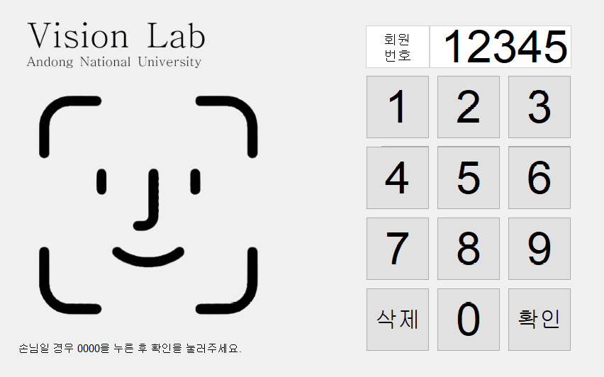

# 얼굴 인식 출입체계

 

## 💻프로젝트 소개

얼굴인식을 통한 회원 출입과 성별인식으로 방문자 파악을 돕는 출입시스템입니다.

## 📆개발 기간

- 2024.01 ~ 현재

### 👬개발 인원

- 팀장 이영훈 - 통신, 소스 코드 통합 및 형상관리
- 팀원 이승구 - Web-BackEnd 개발
- 팀원 김형진 - 사용자 GUI 개발(PyQt5)
- 팀원 하영우 - 얼굴인식을 통한 성별 파악(ResNet50)
- 팀원 백지은 - 얼굴인식을 통한 신원 파악(ArcFace)
- 팀원 황찬웅 - Web-FrontEnd 개발
- 팀원 박채연 - 임베디드 개발(Jetson Nano)

## 📌주요 기능

**사용자** : 얼굴 인식을 통한 출입

**관리자** : 출입 인원 확인

## 상세 개발 환경
